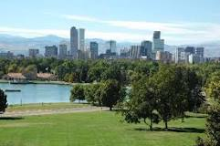

denver
======




Create layers of ENV variables saved to etcd and deploy docker containers using them

## installation

```
$ npm install denver -g
```

## usage

denver will save ENV variables for a stack under a key in etcd.

it will merge stacks in order so one stack can inherit from another.

it will spit out stacks environment in a few useful formats.

## api

### var den = denver(options)

create a new denver object using the options:

 * host - the etcd host (defaults to 127.0.0.1)
 * port - the etcd port (defaults to 4001)
 * key - the base key (default to /denver)

You can always use the envrionment variables to set these values:

 * DENVER_HOST
 * DENVER_PORT
 * DENVER_KEY

```js
var denver = require('denver');

var den = denver({
	host:'127.0.0.1',
	port:4001,
	key:'/denver'
});
```

### den.set(stack, key, value, callback)

set a value for a stack

```js
den.set('app1', 'test', 'hello', function(err){
	// value is written
})
```

### den.get(stack, key, callback)

get a value from a stack

```js
den.get('app1', 'test', function(err, value){
	// value is here!
})
```

### den.ls(callback)

list all of the stacks

```js
den.ls(function(err, stacks){
	// stacks is an array of stack names
})
```

### den.rm(stack, callback)

remove a stack from the db

```js
den.rm('app1', function(err){
	// the app is gone
})
```

### den.env(stacks, callback)

get an object with the values for the environment that is created from merging the stacks array.

```js
den.env([
	'basestack',
	'applicationstack'
], function(err, env){
	// env is an object that is a merged stack env
})
```

You can also just get a single stack env:


```js
den.env('app1', function(err, env){

})
```

## events

### den.on('set', function(stack, key, value){})

emitted when a value is set

### den.on('del', function(stack, key, value){})

emitted when a value is deleted

## cli

### denver ls

List the stack names we have environments for

```bash
$ denver ls
```

### denver rm

Remove a stack from the database

```bash
$ denver rm myapp
```

### denver get <stack> <var>

Print the value of a single environment variable

```bash
$ denver get myapp ADMIN_EMAIL
```

### denver set <stack> <var> <value>

Write the value of a single environment variable

```bash
$ denver set myapp ADMIN_EMAIL bob@thebuilder.com
```

### denver del <stack> <var>

Remove a value from an environment

```bash
$ denver del myapp ADMIN_EMAIL
```

### denver env <stack> <stack>

Print the whole environment for a stack

```bash
$ denver env myapp
```

You can 'merge' several stacks with the env command - this lets you have 'global' envs or whatever:

```bash
$ denver env defaultenv myapp
```

When you merge - the last stack will take precendence - so myapp -> ADMIN_EMAIL would overwrite defaultenv -> ADMIN_EMAIL.

You can merge as many stacks as you want.

### denver docker <stack> <stack>

You can also print the environment in a docker friendly format:

```
$ denver docker defaultenv myapp
```

This would output:

```
-e ADMIN_EMAIL=bob@thebuilder.com -e HOSTNAME=bobthebuilder.com
```

### denver inject <stack>

Read env vars one per line from stdin

file - myenv.txt:

```
HELLO=world
ADMIN_EMAIL=bob@thebuilder.com
```

``` bash
$ cat myenv.txt | denver inject myapp
$ denver docker myapp
```

This would print:

```
-e HELLO=world -e ADMIN_EMAIL=bob@thebuilder.com
```

## license

MIT